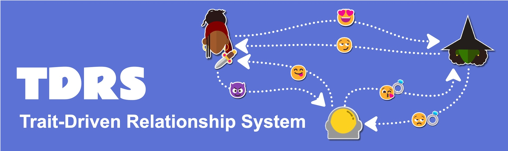

# Trait-Driven Relationship System

**TDRS** (Trait-Driven Relationship System) helps users model dynamic social relationships between characters in Unity projects, using various traits to represent personality traits, emotional states, relationship statuses, and faction affiliations. TDRS is ideal for RPGs, dating sims, adventure games, and life simulation games. Users can leverage TDRS as an additional layer for content gating, NPC decision-making AI, and reactive dialogue presentation.

## Features

- 🤖 Use agents to represent characters, factions, items, religions, concepts, or anything that might form social relationships.
- ❤️ Define relationships representing one agent's feelings about another.
- 📊 Track agents and relationship numerical stat values
- 🏷️ Use traits to represent personality traits, statuses, faction affiliations, and emotional states and apply fitting stat modifiers.
- 👈🏾 Create rules that apply additional modifiers to relationships given that some preconditions are met.
- 🎊 Enable agents to respond to events that happen to other agents, allowing for engaging relationship-driven gameplay scenarios where players must be mindful of the second-order social effects of their interactions with various NPCs.

## Project contents

This repository contains a Unity project with TDRS added as an embedded package. The package-specific code can be found in the `Packages/TDRS` directory. All other data found in the `Assets` folder belong to the samples.

## Documentation

You can learn more about TDRS and how to get started by visiting the [Wiki](https://github.com/ShiJbey/TDRS/wiki). There, you can find a [getting started tutorial](https://github.com/ShiJbey/TDRS/wiki/Getting-Started-Tutorial) and various [how-to guides](https://github.com/ShiJbey/TDRS/wiki/How-to-Guides) to assist you.

## Limitations

- TDRS is not optimized to handle a large number of NPCs. Some users might encounter performance slow-downs if they try to make something like Crusader Kings. More extensive performance profiling is required to investigate this.
